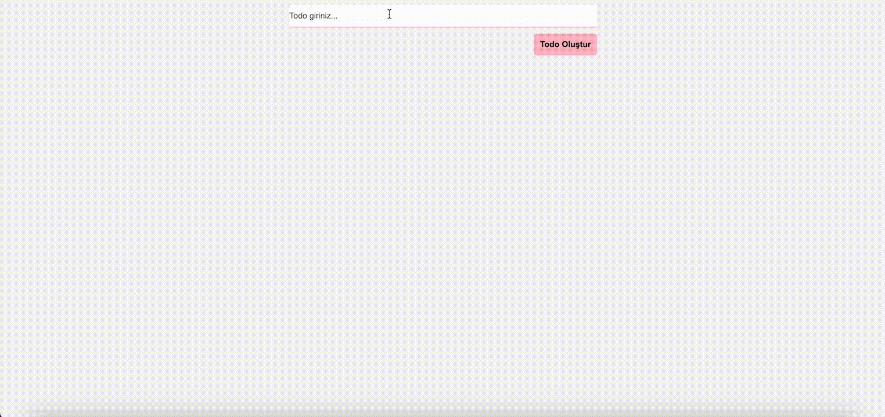

# React Todo App
Bu proje, kullanıcıların yapılacaklar listesini yönetmesine olanak tanıyan basit bir React Todo Uygulamasıdır. Kullanıcılar yeni görevler ekleyebilir, mevcut görevler güncelleyebilir veya silebilir.

# Özellikler
- Yeni görev ekleme.
- Eklenmiş görevlerin düzenlenmesi.
- Tamamlanan görevlerin listeden çıkarılması.

# Kullanılan Teknolojiler
- React-vite
- Css
- React-icons

# Kurulum ve Kullanım
- Depoyu Klonlayın

git clone https://github.com/kullaniciadi/todo-uygulamasi.git
cd todo-uygulamasi

- Gerekli Bağımlılıkları Yükle

npm install

- Uygulamayı Başlat

npm run dev 

# GIF

